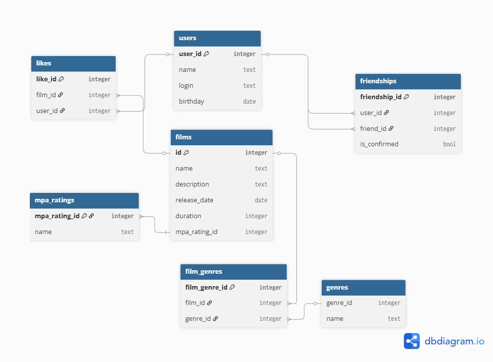

# java-filmorate
Template repository for Filmorate project.

# Диаграмма базы данных



# Примеры запросов

### Получение списка всех фильмов

```sql
SELECT *
FROM films;
```

| film\_id | name                               | description                                                                                                                                                                         | release_date | duration | mpa_rating_id |
|:---------|:-----------------------------------|:------------------------------------------------------------------------------------------------------------------------------------------------------------------------------------|:-------------|:---------|:--------------|
| 1        | 1 + 1                              | Аристократ на коляске нанимает <br/>в сиделки бывшего заключенного. Искрометная французская комедия с Омаром Си                                                                     | 2011-09-23   | 112      | 4             |
| 2        | Джентльмены                        | Гангстеры всех мастей делят наркоферму. Закрученная экшен-комедия Гая Ричи с Мэттью Макконахи и Хью Грантом                                                                         | 2019-12-03   | 113      | 4             |
| 3        | Властелин колец: Братство кольца   | Сказания о Средиземье — это хроника Великой войны за Кольцо, <br/>длившейся не одну тысячу лет. Тот, кто владел Кольцом, получал неограниченную власть, но был обязан служить злу.  | 2010-04-06   | 178      | 3             |

### Получение списка всех пользователей
```sql
SELECT *
FROM users;
```

| user_id | email             | login   | name | birthday    |
|:--------|:------------------|:--------|:-----|:------------|
| 1       | user123@mail.ru   | user    | Alex | 1993-10-10  |
| 2       | user22@gmail.com  | User2   | Max  | 2000-09-22  |
| 3       | friend3@yandex.ru | Friend3 | Fred | 1976-11-18  |


### Получение списка жанров
```sql
SELECT *
FROM genres;
```
| name           | genre_id |
|:---------------|:---------|
| Комедия        | 1        |
| Драма          | 2        |
| Мультфильм     | 3        |
| Триллер        | 4        |
| Документальный | 5        |
| Боевик         | 6        |

### Получение списка MPA рейтинга
```sql
SELECT *
FROM mpa_ratings;
```

| mpa_rating_id | name  |
|:--------------|:------|
| 1             | G     |
| 2             | PG    |
| 3             | PG-13 |
| 4             | R     |
| 5             | NC-17 |

### Получение фильмов по жанру
```sql
SELECT f.name, f.release_date, m.name mpa_rating
FROM films f
JOIN film_genres fg ON f.film_id = fg.film_id
JOIN genres g ON fg.genre_id = g.genre_id
JOIN mpa_ratings mr ON f.mpa_rating_id = m.mpa_rating_id
WHERE g.name = 'Драма'
```

| name                             | release_date | mpa_rating |
|:---------------------------------|:-------------|:-----------|
| 1 + 1                            | 2011-09-23   | R          |
| Властелин колец: Братство кольца | 2010-04-06   | PG-13      |

### Получение списка друзей
```sql
SELECT *
FROM users u
LEFT JOIN friendships f ON u.user_id = f.friend_id; 
```
| user_id | email             | login   | name  | birthday   | friendship_id | user_id | friend_id | is_confirmed |
|:--------|:------------------|:--------|:------|:-----------|:--------------|:--------|:----------|:-------------|
| 1       | user123@mail.ru   | user    | Alex  | 1993-10-10 | 1             | 2       | 1         | true         |
| 1       | user123@mail.ru   | user    | Alex  | 1993-10-10 | 2             | 3       | 1         | true         |
| 2       | user22@gmail.com  | maria   | User2 | 2000-09-22 | 4             | 1       | 2         | true         |
| 2       | user22@gmail.com  | maria   | User2 | 2000-09-22 | 3             | 3       | 2         | true         |
| 3       | friend3@yandex.ru | Friend3 | Fred  | 1976-11-18 | 6             | 1       | 3         | true         |
| 3       | friend3@yandex.ru | Friend3 | Fred  | 1976-11-18 | 5             | 2       | 3         | true         |

### Получение топ-N самых популярных фильмов (по количеству лайков)

```sql
-- Получение топ-5 самых популярных фильмов
SELECT f.film_id, f.name, f.description, f.release_date, f.duration, 
       m.name AS mpa_rating, COUNT(l.user_id) AS likes_count
FROM films f
LEFT JOIN likes l ON f.film_id = l.film_id
JOIN mpa_ratings m ON f.mpa_rating_id = m.mpa_rating_id
GROUP BY f.film_id, f.name, f.description, f.release_date, f.duration, m.name
ORDER BY likes_count DESC
LIMIT 5;
```
| film_id | name            | description                                                                                                                                                                        | release_date | duration | mpa_rating | likes_count |
|:--------|:----------------|:-----------------------------------------------------------------------------------------------------------------------------------------------------------------------------------|:-------------|:---------|:-----------|:------------|
| 2       | Джентельмены    | Гангстеры всех мастей делят наркоферму. Закрученная экшен-комедия Гая Ричи с Мэттью Макконахи и Хью Грантом                                                                        | 2019-12-03   | 113      | R          | 15          |
| 1       | 1 + 1           | Аристократ на коляске нанимает <br/>в сиделки бывшего заключенного. Искрометная французская комедия с Омаром Си                                                                    | 2011-09-23   | 112      | R          | 12          |
| 3       | Властелин колец | Сказания о Средиземье — это хроника Великой войны за Кольцо, <br/>длившейся не одну тысячу лет. Тот, кто владел Кольцом, получал неограниченную власть, но был обязан служить злу. | 2010-04-06   | 178      | PG-13      | 8           |

### Получение общих друзей с id 1 и id 2

```sql
SELECT u.user_id, u.email, u.login, u.name, u.birthday
FROM users u
JOIN friendships f1 ON u.user_id = f1.friend_id AND f1.user_id = 1 AND f1.is_confirmed = true
JOIN friendships f2 ON u.user_id = f2.friend_id AND f2.user_id = 2 AND f2.is_confirmed = true
WHERE u.user_id NOT IN (1, 2);
```
| user_id | email             | login   | name | birthday   |
|:--------|:------------------|:--------|:-----|:-----------|
| 3       | friend3@yandex.ru | Friend3 | Fred | 1976-11-18 |

### Добавление новго фильма
```sql
INSERT INTO films (name, description, release_date, duration, mpa_rating_id)
VALUES ('Интерстеллар', 'Фантастический эпос о путешествии к черной дыре', '2014-10-26', 169, 3);
```

### Добавление жанров для фильма
```sql
INSERT INTO film_genres (film_id, genre_id) 
VALUES 
  (LAST_INSERT_ID(), 2), -- Драма
  (LAST_INSERT_ID(), 6); -- Боевик
```

### Пользователь с ID 1 отправляет запрос на дружбу пользователю с ID 2
```sql
INSERT INTO friendships (user_id, friend_id, is_confirmed)
VALUES (1, 2, false);
```

### Подтверждение дружбы (когда пользователь с ID 2 принимает запрос)
```sql
UPDATE friendships
SET is_confirmed = true
WHERE user_id = 2 AND friend_id = 1;
```
